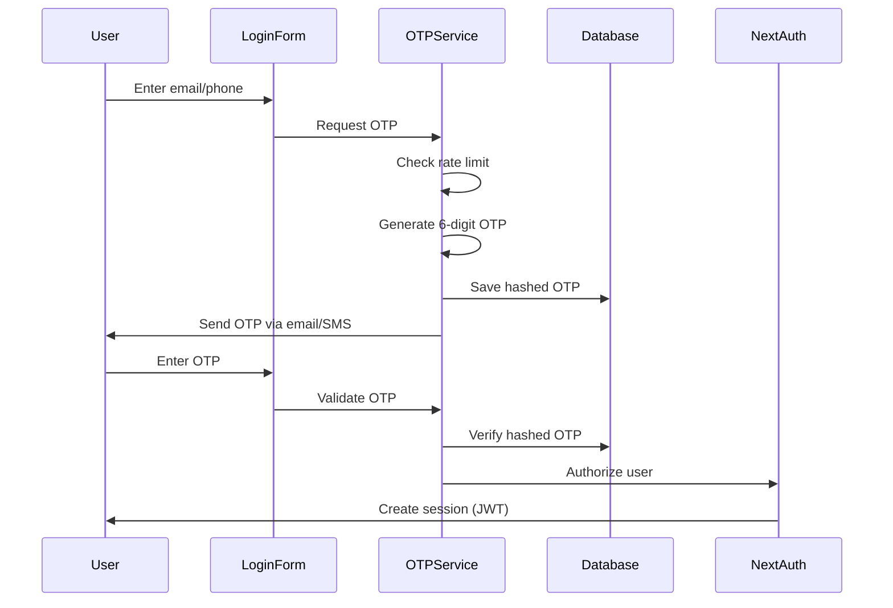

# NextAuth v5 Implementation Documentation

## Overview

This application uses **NextAuth v5 (beta.25)** for authentication, implementing a secure OTP-based authentication system without passwords. The system is designed for maximum security with features like rate limiting, secure session management, and comprehensive logging.

## Architecture

### Core Components

1. **Authentication Configuration** (`/src/auth.ts`)
   - NextAuth v5 with Prisma Adapter
   - JWT-based session strategy
   - Custom Credentials provider
   - Secure cookie configuration

2. **OTP Management** (`/src/lib/user/otp.ts`)
   - 6-digit OTP generation using nanoid
   - BCrypt hashing for secure storage
   - 5-minute expiration time
   - Rate limiting for generation and validation

3. **Middleware** (`/src/middleware.ts`)
   - Route protection
   - Rate limiting enforcement
   - Security headers application
   - Automatic redirect for unauthenticated users

## Authentication Flow

### 1. Login Process



### 2. Session Management

- **Strategy**: JWT tokens
- **Storage**: Secure HTTP-only cookies
- **Caching**: 1-minute session cache for performance
- **Content**: User ID, roles, permissions

## Security Features

### 1. Rate Limiting

```typescript
// OTP Generation: 3 attempts per 15 minutes
const otpGenerationLimiter = {
  limit: 3,
  window: 15 * 60 * 1000 // 15 minutes
};

// OTP Validation: 5 attempts per 5 minutes
const otpValidationLimiter = {
  limit: 5,
  window: 5 * 60 * 1000 // 5 minutes
};

// Global rate limit: 100 requests per minute
const globalLimiter = {
  limit: 100,
  window: 60 * 1000 // 1 minute
};
```

### 2. Cookie Security

```typescript
cookies: {
  sessionToken: {
    name: `${isProduction ? '__Secure-' : ''}next-auth.session-token`,
    options: {
      httpOnly: true,
      sameSite: 'lax',
      path: '/',
      secure: isProduction,
    },
  },
  csrfToken: {
    name: `${isProduction ? '__Host-' : ''}next-auth.csrf-token`,
    options: {
      httpOnly: true,
      sameSite: 'lax',
      path: '/',
      secure: isProduction,
    },
  },
}
```

### 3. Security Headers

- Content Security Policy (CSP) with nonce
- X-Frame-Options: DENY
- X-Content-Type-Options: nosniff
- Strict-Transport-Security (HSTS)

## Database Schema

### User Model
```prisma
model User {
  id            String    @id @default(cuid())
  email         String?   @unique
  phoneNumber   String?   @unique
  emailVerified DateTime?
  name          String?
  roles         UserRole[]
  createdAt     DateTime  @default(now())
  updatedAt     DateTime  @updatedAt
}
```

### Verification Token Model
```prisma
model VerificationToken {
  id         String   @id @default(cuid())
  identifier String   // Email or phone number
  token      String   // Hashed OTP
  type       String   // "EMAIL" or "PHONE"
  expires    DateTime
  createdAt  DateTime @default(now())
  
  @@unique([identifier, token])
}
```

## API Routes

### Authentication Endpoints

1. **NextAuth Route Handler**
   - Path: `/api/auth/[...nextauth]`
   - Methods: GET, POST
   - Handles all NextAuth operations

2. **Protected Routes**
   - `/dashboard/*` - Admin/Agent dashboards
   - `/my-space/*` - User personal space
   - Automatically redirect to login if unauthenticated

### Public Routes
```typescript
const publicRoutes = [
  '/auth/login',
  '/auth/register',
  '/registration',
  '/feedback',
  '/legal',
  '/api/auth',
  '/',
];
```

## Client-Side Usage

### 1. Authentication Hook

```typescript
import { useAuth } from '@/hooks/use-auth';

function Component() {
  const { user, isLoading, isAuthenticated } = useAuth();
  
  if (isLoading) return <LoadingSpinner />;
  if (!isAuthenticated) return <LoginPrompt />;
  
  return <AuthenticatedContent user={user} />;
}
```

### 2. OTP Flow Hook

```typescript
import { useAuthOTP } from '@/hooks/use-auth-otp';

function LoginForm() {
  const { sendOTP, validateOTP, isLoading } = useAuthOTP();
  
  const handleSendOTP = async (identifier: string, type: 'EMAIL' | 'PHONE') => {
    const result = await sendOTP(identifier, type);
    if (result.success) {
      // OTP sent successfully
    }
  };
}
```

### 3. Session Provider

```tsx
// In layout.tsx or providers.tsx
import { SessionProvider } from 'next-auth/react';

export function Providers({ children }: { children: React.ReactNode }) {
  return (
    <SessionProvider>
      {children}
    </SessionProvider>
  );
}
```

## User Roles and Permissions

### Role Hierarchy
1. **SUPERADMIN** - Full system access
2. **ADMIN** - Organization management
3. **MANAGER** - Department management
4. **AGENT** - Service delivery
5. **USER** - Basic user

### Permission Checking

```typescript
// Server-side
const session = await auth();
const hasPermission = session?.user.roles.includes('ADMIN');

// Client-side
const { user } = useAuth();
const isAdmin = user?.roles.includes('ADMIN');
```

## Environment Variables

```env
# Required
NEXTAUTH_URL=http://localhost:3000
NEXTAUTH_SECRET=your-secret-key

# Optional
NODE_ENV=production
```

## Error Handling

### Authentication Errors
- `no_credentials` - Missing credentials
- `user_not_found` - User doesn't exist
- `otp_expired_or_invalid` - OTP expired or wrong
- `otp_generation_rate_limit` - Too many OTP requests
- `otp_validation_rate_limit` - Too many validation attempts

### Error Pages
- `/auth/error` - Authentication error page
- Custom error messages with i18n support

## Logging and Monitoring

### Security Events Logged
1. OTP generation attempts
2. Failed login attempts
3. Rate limit violations
4. Unauthorized access attempts
5. Session creation/destruction

### Log Files
- `logs/security.log` - Security events
- `logs/error.log` - Application errors
- `logs/combined.log` - All events

## Best Practices

1. **Never log OTPs** - Only log metadata
2. **Use secure cookies** - Always in production
3. **Implement rate limiting** - Prevent brute force
4. **Hash sensitive data** - OTPs, tokens
5. **Session management** - Short-lived tokens, regular refresh
6. **Monitor security events** - Track suspicious activity

## Common Issues and Solutions

### 1. OTP Not Received
- Check email/SMS service configuration
- Verify rate limits haven't been exceeded
- Check notification service logs

### 2. Session Expired
- JWT tokens expire after configured time
- Users need to re-authenticate
- Consider implementing refresh tokens

### 3. CSRF Token Mismatch
- Ensure cookies are properly configured
- Check for proxy/CDN issues
- Verify NEXTAUTH_URL matches actual URL

## Testing Authentication

```typescript
// Example test setup
import { mockSession } from '@/tests/utils';

describe('Protected Route', () => {
  it('redirects unauthenticated users', async () => {
    // Test implementation
  });
  
  it('allows authenticated users', async () => {
    mockSession({ user: { id: '1', roles: ['USER'] } });
    // Test implementation
  });
});
```