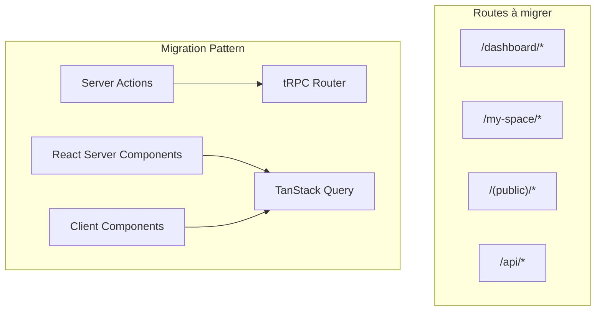

# Guide de Migration tRPC + TanStack Query par Routes/Pages

## Vue d'ensemble

Ce guide détaille la migration de l'application Consulat.ga vers tRPC + TanStack Query, organisée par routes et pages pour faciliter la migration systématique.

## Architecture de migration



## 1. Routes Dashboard (`/dashboard/*`)

### 1.1 Dashboard Principal (`/dashboard/page.tsx`)

**Actions utilisées:**
- `getCurrentUser()` → `api.user.getCurrent.useQuery()`

**Composants à migrer:**
- `SuperAdminDashboard`
- `AdminDashboard` 
- `ManagerDashboard`
- `AgentDashboard`

**Code actuel:**
```typescript
// src/app/(authenticated)/dashboard/page.tsx
const user = await getCurrentUser();
```

**Code migré:**
```typescript
// Version client component
'use client';
const { data: user } = api.user.getCurrent.useQuery();
```

### 1.2 Dashboard Admin (`/dashboard/admin`)

**Requêtes directes Prisma à migrer:**
```typescript
// Actuellement dans admin-dashboard.tsx
const completedRequests = await db.serviceRequest.count({...});
const processingRequests = await db.serviceRequest.count({...});
```

**Router tRPC à créer:**
```typescript
// src/server/api/routers/dashboard.ts
export const dashboardRouter = createTRPCRouter({
  getAdminStats: protectedProcedure
    .query(async ({ ctx }) => {
      const [
        completedRequests,
        processingRequests,
        validatedProfiles,
        pendingProfiles,
        recentRegistrations,
        upcomingAppointments,
      ] = await Promise.all([
        ctx.db.serviceRequest.count({
          where: { status: RequestStatus.COMPLETED },
        }),
        // ... autres requêtes
      ]);
      
      return {
        completedRequests,
        processingRequests,
        validatedProfiles,
        pendingProfiles,
        recentRegistrations,
        upcomingAppointments,
      };
    }),
});
```

### 1.3 Pages SuperAdmin

#### Countries (`/dashboard/(superadmin)/countries/*`)

**Actions dans `_utils/actions/services.ts`:**
- `createCountry()` → `api.countries.create.useMutation()`
- `updateCountry()` → `api.countries.update.useMutation()`
- `deleteCountry()` → `api.countries.delete.useMutation()`

**Composants:**
- `CountriesList` - utilise `getActiveCountries()`
- `CountryForm` - utilise les mutations
- `CreateCountryButton`
- `EditCountryDialog`

#### Organizations (`/dashboard/(superadmin)/organizations/*`)

**Actions à migrer:**
- `getOrganizations()` → `api.organizations.getAll.useQuery()`
- `createOrganization()` → `api.organizations.create.useMutation()`
- `updateOrganization()` → `api.organizations.update.useMutation()`

### 1.4 Autres pages Dashboard

#### Agents (`/dashboard/agents/*`)
- Liste: `getAgents()` → `api.agents.getAll.useQuery()`
- Détail: `getAgentById()` → `api.agents.getById.useQuery()`

#### Appointments (`/dashboard/appointments/*`)
- Liste: `getAppointments()` → `api.appointments.getAll.useQuery()`
- Détail: `getAppointmentById()` → `api.appointments.getById.useQuery()`

#### Requests (`/dashboard/requests/*`)
- Liste: `getServiceRequests()` → `api.requests.getAll.useQuery()`
- Détail: `getServiceRequestById()` → `api.requests.getById.useQuery()`
- Actions: `validateRequest()`, `rejectRequest()` → mutations

#### Services (`/dashboard/services/*`)
- Liste: `getConsularServices()` → `api.services.getAll.useQuery()`
- Création: `createService()` → `api.services.create.useMutation()`
- Édition: `updateService()` → `api.services.update.useMutation()`

## 2. Routes My Space (`/my-space/*`)

### 2.1 Page principale (`/my-space/page.tsx`)

**Actions utilisées:**
- `getCurrentUser()`
- `getUserFullProfileById()`
- Requêtes dashboard stats

**Migration:**
```typescript
// Router tRPC
export const userSpaceRouter = createTRPCRouter({
  getDashboardData: protectedProcedure
    .query(async ({ ctx }) => {
      const profile = await getUserFullProfileById(ctx.session.user.id);
      const stats = await getDashboardStats(ctx.session.user.id);
      return { profile, stats };
    }),
});
```

### 2.2 Profile (`/my-space/profile/*`)

**Actions:**
- `getUserFullProfile()` → `api.profile.getCurrent.useQuery()`
- `getProfileRegistrationRequest()` → `api.profile.getRegistrationRequest.useQuery()`
- `updateProfile()` → `api.profile.update.useMutation()`
- `submitProfileForValidation()` → `api.profile.submit.useMutation()`

**Composants clients à créer:**
- `ProfileTabs` (actuellement server component)
- `ProfileCompletionAssistant`
- Toutes les sections de profil

### 2.3 Services (`/my-space/services/*`)

**Page principale (client component):**
```typescript
'use client';
export default function ServicesPage() {
  const { data: serviceRequests, isLoading } = api.services.getUserRequests.useQuery();
  
  // Remplacer:
  // const requests = await getUserServiceRequests();
}
```

**Available services:**
- `getAvailableConsularServices()` → `api.services.getAvailable.useQuery()`

**Submit service:**
- `createServiceRequest()` → `api.services.createRequest.useMutation()`

### 2.4 Documents (`/my-space/documents/*`)

**Actions:**
- `getUserDocumentsList()` → `api.documents.getUserDocuments.useQuery()`
- `uploadDocument()` → `api.documents.upload.useMutation()`
- `deleteDocument()` → `api.documents.delete.useMutation()`

### 2.5 Children (`/my-space/children/*`)

**Actions:**
- `getUserWithChildren()` → `api.children.getUserChildren.useQuery()`
- `createChildProfile()` → `api.children.create.useMutation()`
- `updateChildProfile()` → `api.children.update.useMutation()`

### 2.6 Appointments (`/my-space/appointments/*`)

**Actions:**
- `getUserAppointments()` → `api.appointments.getUserAppointments.useQuery()`
- `createAppointment()` → `api.appointments.create.useMutation()`
- `rescheduleAppointment()` → `api.appointments.reschedule.useMutation()`

## 3. Routes Publiques (`/(public)/*`)

### 3.1 Listing Profiles (`/listing/profiles/*`)

**Actions:**
- `getPublicProfiles()` → `api.profiles.getPublic.useQuery()`
- `getProfileById()` → `api.profiles.getById.useQuery()`
- `sendProfileMessage()` → `api.profiles.sendMessage.useMutation()`

### 3.2 Registration (`/registration`)

**Actions:**
- `getActiveCountries()` → `api.countries.getActive.useQuery()`
- `createProfile()` → `api.auth.register.useMutation()`

### 3.3 Feedback (`/feedback`)

**Actions:**
- `submitFeedback()` → `api.feedback.submit.useMutation()`

## 4. Routes API (`/api/*`)

### 4.1 Profiles API (`/api/profiles/[id]/message`)

**Migration complète vers tRPC:**
```typescript
// Remplacer l'API route par:
export const profilesRouter = createTRPCRouter({
  sendMessage: protectedProcedure
    .input(z.object({
      profileId: z.string(),
      message: z.string(),
    }))
    .mutation(async ({ ctx, input }) => {
      // Logique de l'API route actuelle
    }),
});
```

### 4.2 UploadThing (`/api/uploadthing`)

**À conserver tel quel** - UploadThing nécessite ses propres routes API.

## 5. Patterns de migration communs

### 5.1 Server Component vers Client Component

**Avant:**
```typescript
// Server Component
export default async function Page() {
  const data = await getServerData();
  return <div>{data}</div>;
}
```

**Après:**
```typescript
// Client Component
'use client';
export default function Page() {
  const { data, isLoading } = api.module.getData.useQuery();
  if (isLoading) return <LoadingSkeleton />;
  return <div>{data}</div>;
}
```

### 5.2 Form avec Server Action

**Avant:**
```typescript
async function handleSubmit(formData: FormData) {
  'use server';
  await updateProfile(formData);
}
```

**Après:**
```typescript
const updateMutation = api.profile.update.useMutation({
  onSuccess: () => {
    toast.success('Profil mis à jour');
    router.refresh();
  },
});

const handleSubmit = (data: ProfileData) => {
  updateMutation.mutate(data);
};
```

### 5.3 Optimistic Updates

```typescript
const utils = api.useUtils();
const updateMutation = api.profile.update.useMutation({
  onMutate: async (newData) => {
    await utils.profile.getCurrent.cancel();
    const previousData = utils.profile.getCurrent.getData();
    utils.profile.getCurrent.setData(undefined, newData);
    return { previousData };
  },
  onError: (err, newData, context) => {
    utils.profile.getCurrent.setData(undefined, context?.previousData);
  },
  onSettled: () => {
    utils.profile.getCurrent.invalidate();
  },
});
```

## 6. Checklist de migration par priorité

### Priorité 1 - Routes critiques

- [ ] **Auth/User**
  - [ ] `/api/auth/*` - Conserver NextAuth
  - [ ] `getCurrentUser()` → `api.user.getCurrent`
  - [ ] `updateUserSettings()` → `api.user.updateSettings`

- [ ] **Profile principal**
  - [ ] `/my-space/profile` - Convertir en client component
  - [ ] Toutes les actions de profil
  - [ ] Formulaires de mise à jour

- [ ] **Services consulaires**
  - [ ] `/my-space/services` - Déjà client component
  - [ ] `/my-space/services/available`
  - [ ] `/my-space/services/request/[id]`

### Priorité 2 - Routes administratives

- [ ] **Dashboard admin**
  - [ ] Stats dashboard
  - [ ] Gestion des demandes
  - [ ] Gestion des agents

- [ ] **Documents**
  - [ ] Liste des documents
  - [ ] Upload/suppression

- [ ] **Appointments**
  - [ ] Liste et création
  - [ ] Reschedule

### Priorité 3 - Routes secondaires

- [ ] **SuperAdmin**
  - [ ] Gestion pays
  - [ ] Gestion organisations

- [ ] **Routes publiques**
  - [ ] Listing profiles
  - [ ] Contact profile

- [ ] **Autres**
  - [ ] Notifications
  - [ ] Feedback
  - [ ] Children profiles

## 7. Routers tRPC à créer

```typescript
// src/server/api/root.ts
export const appRouter = createTRPCRouter({
  // Core
  auth: authRouter,
  user: userRouter,
  profile: profileRouter,
  
  // Services
  services: servicesRouter,
  documents: documentsRouter,
  appointments: appointmentsRouter,
  
  // Admin
  dashboard: dashboardRouter,
  agents: agentsRouter,
  requests: requestsRouter,
  
  // SuperAdmin
  countries: countriesRouter,
  organizations: organizationsRouter,
  
  // Others
  children: childrenRouter,
  notifications: notificationsRouter,
  feedback: feedbackRouter,
  profiles: profilesRouter, // Public profiles
});
```

## 8. Ordre de migration recommandé

1. **Semaine 1**: Core (auth, user, profile)
2. **Semaine 2**: Services principaux (services, documents, appointments)
3. **Semaine 3**: Admin (dashboard, requests, agents)
4. **Semaine 4**: Reste (children, notifications, public)

## 9. Tests à implémenter

Pour chaque route migrée:
- [ ] Tests unitaires des routers tRPC
- [ ] Tests d'intégration des mutations
- [ ] Tests E2E des workflows complets
- [ ] Tests de performance (cache, optimistic updates)

## 10. Monitoring post-migration

- Surveiller les performances avec TanStack Query Devtools
- Logger les erreurs tRPC
- Monitorer les temps de réponse
- Vérifier l'utilisation du cache 